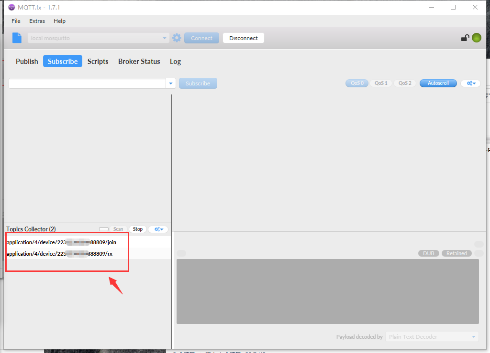

# MQTT Subscribe Quick Start

## Summary

MQTT is a publish / subscribe protocol based on TCP / IP, which can connect a large number of remote sensors and control devices. It is a lightweight message subscription and publishing protocol.

```Tip:: The software version used in this example is MQTT.fx 1.7.1 and python 3.8.5

```

## Use MQTT.fx Subscribe To Messages

[Download MQTT.fx](http://mqttfx.jensd.de/index.php/download) 

### MQTT Access To Cloud Server

Click the button shown below to configure the connection information.


Enter the information, where ``Broker Address`` is the server address corresponding to [selected frequency band](https://cloud-platform-docs-zh-cn.readthedocs.io/zh/latest/quick_start.html#id3) ,the port number is ``1883`` ，select ``User Credentials`` to enter [account and password](https://cloud-platform-docs-zh-cn.readthedocs.io/zh/latest/quick_start.html#id2)，and click ``OK`` . 


Click ``Connect`` to connect to the server. After successful connection, it will be displayed in green on the right.


### Subscribe To Messages

Click ``Subscribe`` -> ``scan`` , Wait for the ``nodes`` that access the Cloud Server to transmit data.


When a ``node`` uploads data, information will be scanned in the scan column.



Select one as your subscription information. When there is a matching subscription information uploaded, it will be displayed in the data column. The following example subscribes to ``application/4/device/22........09/rx`` 


## Subscribing To MQTT Using Python

After you  [Download Pyhton](https://www.python.org/downloads/) , you need to enter ``pip install paho-mqtt python-etcd`` in the terminal to install the module.

### Information Configuration

Change the following data to the [account and password](https://cloud-platform-docs-zh-cn.readthedocs.io/zh/latest/quick_start.html#id2) for accessing the [Cloud Server](http://cloud.heltec.org) .


Modify the following data to the content you want to subscribe to.


Modify host to the server address of the selected frequency band, and the port number is 1883 by default.


### Run Python


