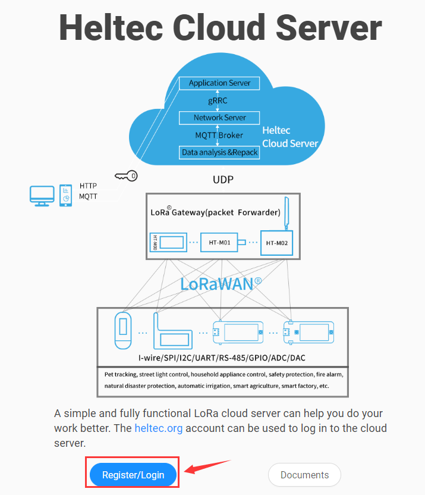

# Cloud Server Quick Start

[简体中文](https://heltec-automation.readthedocs.io/zh_CN/latest/quick_start.html)

## Summary

Cloud Server is a simple and fully functional LoRa cloud server. This page shows how to use this cloud server quickly.

## Create Base Configuration

### Login/Register

Open the  ``Browser``, enter the URL  [http://cloud.heltec.org](http://cloud.heltc.org)，you will see the following interface，click ``Register/Login`` 。

If you already have a [heltec.org](https://heltec.org) account, you can enter the correct user name and password directly and click ``LOG IN`` . If you don't have an account, you need to reister first. Enter the user name, email address and password. Click ``REGISTER``  to complete the registration，and you can log in successfully.

### Select Frequency Band

After entering the paltform, select the regional frequency band you need, such as ``AS923`` .

### Create Gateway

Click ``Gateways``->``GatewaysCreate`` ，Select the ``GENERAL`` menu and fill in the corresponding information. The following three options are required and the remaining options are optional. Finally, slide to the bottom of the page and click  ``CREATE GATEWAY`` to complete the gateway creation. Here is an example.

### Create Application

Click ``Apps``->``AppsCreate`` ， fill in the corresponding information. The following two options are required and the remaining options are optional. Click ``CREATE APPLICATION`` to complete creation. Here is an example.

### Create Device

Click ``Apps``->``AppsList`` ，You will see the application we created before (the ``AppName`` in the example)，and click it.

Select ``DEVICES`` menu，Click ``CREATE`` to create device.

Select ``GENERAL``  menu， fill in the corresponding information，The following four options are required and the remaining options are optional. Click ``CREATE DEVICE`` 。

Fill in the required ``Key`` or ``LoRa Protocol`` information according to the selected  ``Device-profile`` option. For example, in this example, select ``Device-profile`` as ``OTAA/CLASS-A`` , as shown below：

